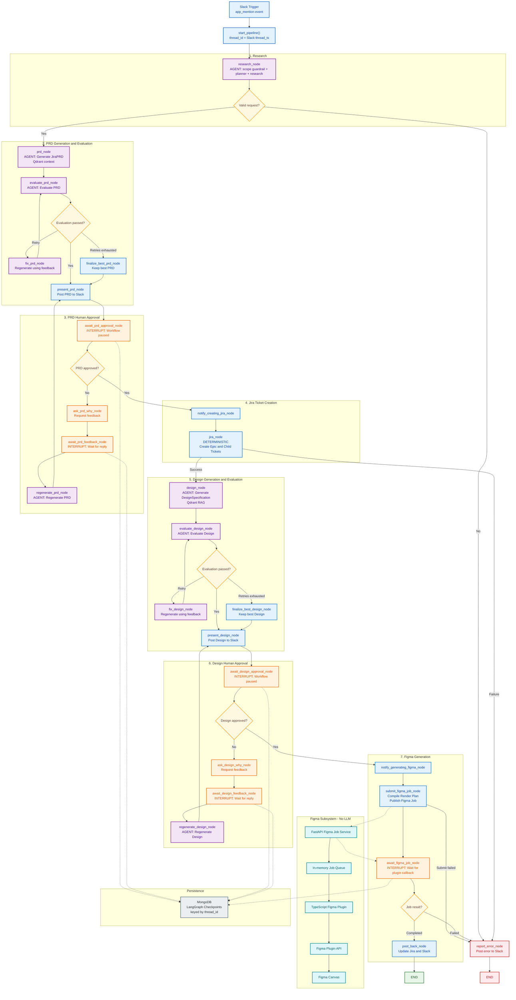

# Agentic SDLC Automation

An agentic pipeline that turns a single Slack feature request into an approved Jira epic (with child tickets), an approved UI/UX design specification, and a real, populated Figma file — with a human reviewer as an explicit, required checkpoint at every major stage.

This README documents what is **actually implemented** in this repository, verified by reading the code, running the compiler/schema/service tests included in this repo, and inspecting live MongoDB checkpoint data. It does not describe a generic or aspirational SDLC platform.

---

## 1. Project Overview

**Problem it solves.** Turning a one-line Slack feature request into an implementation-ready Jira epic and an approved design normally means a PM writing a PRD, a designer building screens, and someone manually creating Jira tickets and a Figma file — with review/rework cycles at every stage. This project automates the *drafting* work (PRD, design, Figma layout) while keeping a human as the actual decision-maker at every stage that matters (epic content, design content), rather than fully automating judgment calls a human should own.

**Why agentic orchestration is useful here.** Each stage (research synthesis, requirement writing, design interpretation, quality scoring) is a judgment task with no fixed algorithm — that's what LLM agents are for. But the *sequence* between them — pause for approval, branch on a rejection, retry a failed quality check up to a bound, resume exactly where a multi-minute-long external process (a person, or a Figma plugin) left off — needs to be reliable and inspectable, not left to prompt-level improvisation. LangGraph provides that: a typed state machine with durable checkpoints, so a pipeline paused waiting on a Slack reply or a Figma plugin can survive a process restart and resume from the exact node it was waiting at.

**What's agentic (LLM-backed, non-deterministic).** Scope classification, web-research query planning and synthesis, PRD writing, PRD quality scoring, PRD auto-fix, design writing, design quality scoring, design auto-fix.

**What's deterministic (plain code, no LLM).** Jira ticket creation and formatting, Jira assignee resolution, the entire `DesignSpecification → FigmaRenderPlan` compiler, the Figma job queue/lifecycle, the Figma plugin's node-creation logic, all Slack message formatting, and all persistence/resume mechanics.

---

## 2. High-Level Architecture


---

## 3. Workflow (step-by-step)

- **1** — Slack `app_mention` received (Socket Mode, not a webhook) — *Deterministic (slack_bolt)*
- **2** — `research_node`: scope guardrail rejects off-topic/injection input; if accepted, a planner agent proposes search queries, a search agent synthesizes an answer for each (from model knowledge — see §6) — *Agent*
- **3** — `prd_node`: writes a `JiraPRD`, using research context + similar past-approved PRDs + recurring reviewer feedback themes retrieved from Qdrant — *Agent*
- **4** — `evaluate_prd_node` → `fix_prd_node` (at most once) → `present_prd_node` — *Agent (eval + fix), Deterministic (present)*
- **5** — `await_prd_approval_node`: **pipeline pauses**, checkpointed to MongoDB — *HITL*
- **6a** — Approved → `jira_node` creates the epic + child tickets in Jira — *Deterministic*
- **6b** — Rejected → `ask_prd_why_node` → `await_prd_feedback_node` (pauses again) → `regenerate_prd_node` → back to step 4's presentation — *Agent (regenerate)*
- **7** — `design_node`: writes a `DesignSpecification` from the *approved* PRD, using design-standards RAG + past-approved designs + design feedback themes — *Agent*
- **8** — `evaluate_design_node` → `fix_design_node` (at most once) → `present_design_node` — *Agent (eval + fix), Deterministic (present)*
- **9** — `await_design_approval_node`: **pipeline pauses** — *HITL*
- **10a** — Approved → `submit_figma_job_node` compiles the `DesignSpecification` into a `FigmaRenderPlan` and publishes it via `FigmaPublisher` — *Deterministic*
- **10b** — Rejected → same reject/feedback/regenerate loop as step 6b, for the design — *Agent (regenerate)*
- **11** — `await_figma_job_node`: **pipeline pauses**, waiting for the Figma plugin (a separate process, possibly minutes away) to report back — *HITL-adjacent (waits on external system, not a person)*
- **12** — Figma plugin polls the FastAPI job service, executes the render plan against the real Figma Plugin API, reports success/failure — *Deterministic*
- **13** — The completion/failure callback resumes the *same* LangGraph thread; `post_back_node` writes the result to the Jira epic as a comment and posts it to the Slack thread — *Deterministic*

---

## 4. Agents

All agents are built with the OpenAI Agents SDK (`agents.Agent` / `agents.Runner`), pointed at **Gemini** via Google's OpenAI-compatible endpoint (`ai_agents/gemini_model.py`) — not OpenAI's own models, and not Claude/Anthropic (see §10 for why that matters).

- **Request Scope Guardrail** (`search_planer_agent.py`, light tier) — Reject off-topic/empty/prompt-injection input before any generation is spent on it. Input: Raw user message → Output: `RequestScopeCheck`.
- **Planner Agent** (`search_planer_agent.py`, light tier) — Propose N search queries for a topic. Input: User query → Output: `WebSearchPlan`.
- **Search Agent** (`search_planer_agent.py`, light tier) — Synthesize a concise summary per query. Input: One query + reason → Output: plain text.
- **JIRA PRD Writer Agent** (`writer_agent.py`, full tier) — Convert request + research (+ RAG context, + revision feedback) into an implementation-ready epic and child tickets. Input: User request, research text, optional previous draft + feedback → Output: `JiraPRD`.
- **PRD Evaluator Agent** (`prd_evaluator.py`, light tier) — Score a PRD as an automated quality gate before a human sees it. Input: User request + `JiraPRD` → Output: `PRDEvaluation`.
- **Design Agent** (`design_agent.py`, full tier) — Convert an approved PRD into a full UI/UX design spec, following org design-system RAG context. Input: Approved PRD text, optional previous design + feedback → Output: `DesignSpecification`.
- **Design Evaluator Agent** (`design_evaluator.py`, light tier) — Score a design as an automated quality gate. Input: PRD + `DesignSpecification` → Output: `DesignEvaluation`.

"Light" tier (`LIGHT_GEMINI_MODEL` = `gemini-3.5-flash-lite`) is used for classification/scoring/planning calls that run on every request (sometimes several times); "full" tier (`DEFAULT_GEMINI_MODEL` = `gemini-3.6-flash`) is reserved for the two actual content-generation calls (PRD, design), where output quality matters most.

All revision-mode agents (PRD writer, design writer) are explicitly instructed to treat a rework as a **surgical edit** of the previous draft, not a regeneration — only the specific reviewer-requested change should differ from the prior output.

---

## 5. Structured Outputs (Pydantic schemas)

- **`JiraPRD`** (`ai_agents/schemas/prd_schema.py`) — The epic: title, description, problem statement, objective, solution, business rules, functional/non-functional requirements, metrics, dependencies, assumptions, open questions, acceptance criteria, `design_link`/`design_required`, and a list of `ChildWorkItem`.
- **`ChildWorkItem`** (same file) — One child Jira ticket: title, description, `work_type` (`design`|`frontend`|`backend`|`integration`|`qa`|`devops` — a `Literal`, enforced by Pydantic), component, requirements, dependencies, acceptance criteria, optional design link. The writer agent is explicitly instructed to identify `work_type` only, never an assignee — see §9.
- **`PRDEvaluation`** (`ai_agents/schemas/evaluation_schema.py`) — Four 0–100 scores (completeness, clarity, testability, company-standard), lists of missing requirements/contradictions/ambiguous requirements, `passed: bool`, one-line `recommendation`.
- **`DesignSpecification`** (`ai_agents/schemas/design_schema.py`) — Feature name, summary, optional existing design link, a list of `ScreenDesign` (name, purpose, layout, components, user actions, navigation, error/empty/loading states, responsive requirements), reusable component names, accessibility requirements, design-system rules, assumptions, dependencies, `figma_required: bool`.
- **`DesignEvaluation`** (`ai_agents/schemas/evaluation_schema.py`) — Four 0–100 scores (accessibility, consistency, completeness, PRD coverage), lists of missing states/accessibility issues/consistency issues/coverage gaps, `passed: bool`, `recommendation`.
- **`FigmaGenerationResult`** (`ai_agents/schemas/design_schema.py`) — `file_key`, `file_url`, `success`, `built_screens`, `notes` — what the Figma plugin reports back, and what `post_back_node` writes to Jira/Slack.
- **`FigmaRenderPlan`** (`integrations/figma/render_plan/schema.py`) — A validated, deterministic list of `Operation`s (a Pydantic discriminated union: `create_page`, `create_frame`, `create_text`, `set_auto_layout`, `set_fill`, `create_component`) plus `main_page_ref` and `screen_names`. This is the *only* thing the Figma plugin ever receives — never the raw `DesignSpecification`.

Every LLM call in this project uses `output_type=<schema>` on the `Agent` — there is no free-text parsing of model output anywhere in the pipeline.

---

## 6. RAG

There are **two** separate retrieval systems in this repo, both backed by the same local Qdrant instance and the same Gemini embedding model (`gemini-embedding-001`, 3072-dim, cosine distance):

**A. Static knowledge base** (`rag_knowledge/` → collection `sdlc_knowledge`)
- Source: 28 Markdown files (coding/security/testing/deployment/design standards, generic — see repo for actual content).
- Chunking: `RecursiveCharacterTextSplitter(chunk_size=1000, chunk_overlap=400)` (`rag/ingest.py`).
- Indexed via a **one-off script** (`python rag/ingest.py`), not run automatically — batched (50 docs/batch) with retry-on-429 handling for Gemini's free-tier embedding rate limit.
- Retrieval: `rag/retrieval.py`'s `retrieve_documents(query)` does `similarity_search(query, k=4)` and joins the 4 chunks' text. Used by the Design Agent as "organization design standards" context.

**B. Self-learning feedback store** (`ai_agents/learning/store.py` → 3 collections: `approved_prds`, `approved_designs`, `reviewer_feedback`)
- Every PRD/design that gets human-approved is embedded and upserted (deterministic point ID from a hash of the Jira key, so re-recording the same epic overwrites rather than duplicates).
- Every rejection reason a reviewer gives is also recorded, tagged by stage (`"prd"`/`"design"`).
- Before generating a new PRD/design, the pipeline retrieves the 2 most similar past-approved examples and the 3 most relevant past feedback items for that stage, and includes them as few-shot context.

**How context reaches agents:** both are plain string concatenation into the agent's prompt (`_learned_prd_context`/`_learned_design_context` in `graph/lang_graph.py`, and `retrieve_documents()`'s result inside `design_agent.py`'s prompt) — no reranking, no citation tracking.

**Graceful failure:** every retrieval/write function in both systems wraps its Qdrant/embedding call in a broad `try/except`, logs, and degrades to an empty result (`""` or `[]`) rather than raising — verified live in this session: with Qdrant not running locally, `retrieve_documents()` returned `""` without crashing (real connection failure, not simulated).

**On quality:** retrieval correctness/relevance was **not** evaluated as part of this project — no retrieval-quality metric, no eval set. What's verified is that the mechanism works and fails safely, not that it retrieves the *best* possible context.

---

## 7. PRD Evaluation and Auto-Fix

Both the PRD and design loops share the same shape (`MAX_AUTO_FIX_ATTEMPTS = 1` in `graph/lang_graph.py`):

1. Generate → Evaluate.
2. If `passed=True` (PRD: all of completeness/clarity/testability ≥ 70 and no contradictions; design: all four scores ≥ 70 and no PRD-coverage gaps), go straight to presenting it to the human.
3. If failed and no auto-fix attempt has been used yet: convert the evaluator's structured findings (missing requirements, contradictions, ambiguous items — or missing states/accessibility/consistency/coverage gaps for design) into feedback items, and re-run generation through the **same revision-mode machinery** used for human rework.
4. Re-evaluate. Whichever of the two attempts scored higher (sum of the four sub-scores) is tracked as "best" throughout.
5. If the cap is hit without passing, the **best-scoring attempt** (not necessarily the last one) is what reaches the human — with the evaluator's verdict shown alongside it, so the reviewer isn't shown a silently-cleared warning.

The cap is intentionally low (1): each attempt costs a full evaluate+regenerate LLM round trip, and since a human is the real quality gate on every rework anyway, more automatic attempts weren't worth the latency.

---

## 8. Human-in-the-Loop

Implemented with LangGraph's native `interrupt()` / `Command(resume=...)` mechanism — there is no polling loop or manual state machine for this.

- A node calls `interrupt({"waiting_for": "...", ...})`. Execution genuinely pauses — the Python process is free to do other work (or restart) while paused.
- **`thread_id` is the Slack thread's own timestamp** (`event["ts"]` on the triggering `app_mention`), not a generated UUID — so a Slack thread *is* the LangGraph run.
- Every checkpoint (the graph's full state at that pause point) is written to MongoDB via `MongoDBSaver`, keyed by `thread_id`.
- A Slack button click (`approve_prd`, `reject_prd`, `approve_design`, `reject_design`) or a threaded text reply calls `resume_pipeline(thread_id, resume_value)`, which does `Command(resume=resume_value)` against that `thread_id` — execution continues from the exact line inside the paused node, not from the top of the graph.
- `get_pending_node(thread_id)` reads which node a thread is currently paused at, without touching/resuming it — used to (a) ignore a stray Slack thread reply that isn't actually feedback the pipeline is waiting for, and (b) guard against acting on a stale/duplicate button click.
- `has_existing_run(thread_id)` guards against Slack's own event-redelivery behavior starting a second, forked run on top of an existing one.
- As of this cleanup pass, `resume_pipeline` explicitly checks for an existing checkpoint before resuming — resuming an unknown `thread_id` raises a clear `ValueError` instead of the state machine silently falling through into `research_node` with an empty state.

The **same** `resume_pipeline` function is called from three different places: Slack action handlers (approve/reject), the Slack message handler (feedback text), and the Figma job service's completion/failure HTTP handlers — proving the pause/resume mechanism doesn't care *what* triggers the resume, only that it happens against the right `thread_id`.

---

## 9. Jira Integration

`jira_node` (deterministic) calls `create_jira_from_prd(prd, project_key)`, which:
1. Creates the parent epic via `POST /rest/api/3/issue`.
2. Creates every `ChildWorkItem` concurrently (`asyncio.gather`) as its own child ticket, linked to the parent.
3. Reports which children succeeded even if others failed, rather than all-or-nothing.

**Assignee resolution is deliberately kept out of the LLM.** The PRD writer agent's instructions explicitly say: *"Do NOT assign individual employees. Do NOT generate Jira account IDs. Do NOT choose assignees."* — it identifies only `work_type`. A separate, deterministic function, `resolve_assignee()` (`ai_agents/jira/assignee_resolver.py`), maps each `work_type` to a configured Jira `accountId` read from settings/env (`JIRA_ASSIGNEE_DESIGN`, `_FRONTEND`, `_BACKEND`, `_INTEGRATION`, `_QA`, `_DEVOPS`) — unconfigured means the ticket is created unassigned, not blocked.

The Jira HTTP client (`ai_agents/jira/client.py`) retries transport errors up to 3 times with backoff, and returns 4xx/5xx responses as a structured `{"error": True, ...}` dict rather than raising — so a Jira failure surfaces as a clear pipeline error state (`report_error_node`), not an unhandled exception.

No account IDs, tickets, or URLs are reproduced in this document — configure your own via the environment variables in §15.

---

## 10. Figma Architecture

This is the most re-architected part of the project, and the distinction below is the whole point of the design:

```
DesignSpecification                       (LLM output, Pydantic-validated)
      |
Python compiler (deterministic)           integrations/figma/render_plan/compiler.py
      |
FigmaRenderPlan                           (validated Pydantic discriminated union of ops)
      |
FigmaPublisher (Protocol/abstraction)      integrations/figma/publisher.py
      |
PluginFigmaPublisher (implementation)      same file -- delegates to the job service over HTTP
      |
FastAPI Figma Job Service                  api/main.py + integrations/figma/service/
      |  (JSON over HTTP: POST /figma/jobs, GET /figma/jobs/next,
      |   POST /figma/jobs/{id}/complete|fail, GET /figma/jobs/{id})
      |
Thin TypeScript plugin                     integrations/figma/plugin/code.ts (219 lines)
      |
Figma Plugin API                           figma.createPage / createFrame / createText / ...
      |
Figma canvas
      |
completion/failure callback  ─────────────> LangGraph resume (interrupt/Command)
```

**Explicitly, by design:**
- **The TypeScript plugin is not an AI agent and makes no decisions.** It is a `switch` statement over 6 operation types; each case is exactly one Figma Plugin API call. It has no knowledge of "screens," "components," "accessibility," or any other `DesignSpecification` concept — confirmed by grep: the only design-related strings anywhere in `code.ts` are the opaque `screen_names` label list, echoed back verbatim into the completion report, never inspected.
- **All reasoning stays in Python.** Which screens exist, what a "Components" section contains, how reusable components and design notes are laid out — all of that is decided once, in `compiler.py`, before anything crosses into TypeScript.
- **The plugin is a thin, deterministic adapter**, not a rendering engine with judgment. Given the same `FigmaRenderPlan` twice, it produces the same Figma nodes twice (see §17 for the determinism test).
- **Claude and MCP are not part of the current runtime architecture.** An earlier implementation shelled out to the `claude` CLI, which acted as an MCP client against Figma's remote MCP server (the only way to reach Figma's generative `create_new_file`/`use_figma` tools, since Figma's remote MCP server allowlists specific OAuth clients — Claude Code, Cursor, Windsurf — and does not support Dynamic Client Registration for arbitrary clients; confirmed live via a 403 on an unauthenticated registration attempt and a 401 using a Personal Access Token as bearer credential). That implementation is preserved, unimported, at `integrations/figma/legacy/` in git history for reference, but is not on the runtime path and was removed from the working tree in this cleanup pass. The current architecture reaches the Figma canvas exclusively through the real Figma Plugin API, with zero Claude/Anthropic/MCP dependency anywhere in the request path.

Why the job service exists at all rather than a direct call: the `FigmaRenderPlan` compiler runs inside the LangGraph process, but a Figma plugin only executes while a person has it open and running inside the Figma desktop app — that could be minutes away. `submit_figma_job_node` hands the plan off and the graph pauses (`await_figma_job_node`); the plugin polls for work on its own schedule and reports back whenever it's actually run, resuming the exact paused thread.

---

## 11. Persistence and Recovery

- **`MongoDBSaver`** (`langgraph-checkpoint-mongodb`) persists the full `PipelineState` at every pause point, keyed by `thread_id`, to a local MongoDB instance (`checkpointing_db`, collections `checkpoints` and `checkpoint_writes`).
- **Serialization**: LangGraph's default checkpoint serializer (`JsonPlusSerializer`) treats any custom Pydantic model as an "unregistered type" and — as of `langgraph-checkpoint` 4.2.0 — logs a warning that this will be blocked in a future release. This project explicitly registers the 5 real Pydantic types that ever appear in state (`JiraPRD`, `PRDEvaluation`, `DesignSpecification`, `DesignEvaluation`, `FigmaGenerationResult`) via `allowed_msgpack_modules`, which silences the warning **and** hardens deserialization (any other, unexpected type would now be blocked rather than silently deserialized) — verified to load all real pre-existing checkpoints identically before and after this change.
- **Interrupted-workflow recovery**: because state lives in MongoDB, not in process memory, a pipeline paused at any `await_*_node` survives a full process restart — `resume_pipeline(thread_id, ...)` reconnects to Mongo and continues from exactly where it left off. This was exercised directly in this session's tests, not just asserted.
- Resuming a `thread_id` with **no** checkpoint at all now fails clearly (`ValueError: No checkpoint found for thread_id '...'`) instead of silently attempting to run the graph from `START` with an empty state.

---

## 12. Failure Handling

Only paths that actually exist in the code:

- **Off-topic/injection input** → the scope guardrail rejects it before any PRD/Jira/Figma work happens (`RequestRejectedError`, caught in `research_node`).
- **Jira creation failure** (parent or any child) → `jira_node` returns an error state, routed to `report_error_node`, posted to the Slack thread. Successfully-created children are still reported.
- **Figma job submission failure** (the HTTP call to the job service itself fails) → caught in `submit_figma_job_node`, routed to `report_error_node`.
- **Figma plugin failure** (a Plugin API call throws inside `code.ts`) → caught per-operation in `code.ts`, reported via `POST /figma/jobs/{id}/fail`, which resumes the graph with an error, routed to `report_error_node`.
- **Duplicate/stale actions**: a stale Slack button click on an orphaned message, a Slack event redelivery, or a duplicate Figma job completion call are all explicitly detected and ignored/rejected (409 Conflict for the last one) rather than silently double-processed.
- **RAG/embedding failures** (Qdrant down, embedding quota hit) → degrade to empty context, never crash the pipeline (see §6).
- **Unknown `thread_id` resume** → explicit `ValueError`, not a crash inside an unrelated node (see §11).

---

## 13. Technology Stack

- **Orchestration**: LangGraph 1.2.11 (`langgraph-checkpoint` 4.2.0, `langgraph-checkpoint-mongodb` 0.5.0)
- **Agent framework**: OpenAI Agents SDK (`openai-agents`)
- **LLM provider**: Google Gemini, via its OpenAI-compatible endpoint
- **Embeddings**: Gemini (`gemini-embedding-001`, 3072-dim)
- **Vector store**: Qdrant (`qdrant-client`, `langchain-qdrant`)
- **Checkpoint store**: MongoDB (`pymongo`)
- **Human interface**: Slack, Socket Mode (`slack_bolt`, `slack_sdk`)
- **Issue tracking**: Jira Cloud REST API v3 (`httpx`)
- **Figma job service**: FastAPI + Uvicorn
- **Figma plugin**: TypeScript, compiled with `tsc`, `@figma/plugin-typings`
- **Schemas/validation**: Pydantic v2, `pydantic-settings`
- **Language (backend)**: Python 3.13

---

## 14. Repository Structure

```
graph/lang_graph.py                    LangGraph state machine -- every node, edge, router
config/settings.py                     Pydantic-settings config (env-driven)

ai_agents/
  research_agent/                      scope guardrail, planner, search, PRD writer agents
  design_agent/                        Design agent + Slack-formatting helper
  evaluation/                          PRD/design evaluator agents
  jira/                                Jira HTTP client, ticket creation, assignee resolution
  learning/store.py                    self-learning approved-content + feedback store (Qdrant)
  schemas/                             JiraPRD, DesignSpecification, evaluation schemas

rag/
  ingest.py                            one-off script: chunk + embed rag_knowledge/ into Qdrant
  retrieval.py                         similarity_search(k=4) for the Design Agent
rag_knowledge/                         static Markdown knowledge base (generic, portfolio-safe)

integrations/figma/
  render_plan/                         DesignSpecification -> FigmaRenderPlan compiler + schema
  publisher.py                         FigmaPublisher abstraction + PluginFigmaPublisher
  service/                             FastAPI routes, job lifecycle, auth
  schemas/job.py                       FigmaJob + request/response models
  client.py                            HTTP client LangGraph uses to submit a job
  plugin/                              the actual Figma plugin (manifest.json, code.ts, ui.html)

api/main.py                            FastAPI app -- the Figma job service (only HTTP surface)

slack/
  run.py, app.py                       Socket Mode entrypoint
  events.py, messages.py, actions.py   app_mention / thread-reply / button handlers
  blocks.py, formatter.py              Slack Block Kit message construction
```

---

## 15. Local Setup

Requires: Python 3.13, Node.js (for the plugin build), a local MongoDB instance, a local Qdrant instance (optional — degrades gracefully if absent), a Figma desktop app (for the plugin), and API credentials for Slack, Jira, and Gemini.

```bash
pip install -r requirements.txt
cp .env.example .env   # then fill in real values -- never commit .env
```

Environment variables (see `.env.example` for the full, current list — placeholders only, shown here abbreviated):

```
OPENAI_API_KEY=            # used by the openai-agents SDK client plumbing
GEMINI_API_KEY=            # the actual LLM provider for every agent

SLACK_BOT_TOKEN=
SLACK_APP_TOKEN=           # xapp-... , Socket Mode
SLACK_SIGNING_SECRET=

QDRANT_URL=http://localhost:6333
QDRANT_API_KEY=            # blank if auth disabled

JIRA_BASE_URL=             # https://your-domain.atlassian.net
JIRA_EMAIL=
JIRA_API_TOKEN=
JIRA_PROJECT_KEY=
JIRA_ASSIGNEE_DESIGN=      # Jira Cloud accountId, per work type -- blank = unassigned
JIRA_ASSIGNEE_FRONTEND=
JIRA_ASSIGNEE_BACKEND=
JIRA_ASSIGNEE_INTEGRATION=
JIRA_ASSIGNEE_QA=
JIRA_ASSIGNEE_DEVOPS=

FIGMA_PLUGIN_API_TOKEN=    # shared secret between the plugin and the job service
FIGMA_JOB_SERVICE_PORT=8787
```

Also requires a local MongoDB reachable at `mongodb://localhost:27017` (hardcoded in `graph/lang_graph.py`'s `DB_URL` — not yet environment-configurable).

---

## 16. Running the Project

This is **two separate long-running processes**, plus a one-time knowledge-base ingest:

```bash
# One-time (or whenever rag_knowledge/ changes) -- requires Qdrant running
python rag/ingest.py

# Process 1 -- Slack bot (Socket Mode)
python -m slack.run

# Process 2 -- Figma job service, for the plugin to poll
uvicorn api.main:app --port 8787
```

**Figma plugin** (loaded manually into the Figma desktop app):
```bash
cd integrations/figma/plugin
npm install
npm run build          # tsc -> code.js
```
Then in Figma: Plugins → Development → Import plugin from manifest → select `integrations/figma/plugin/manifest.json`. Open the plugin, paste `FIGMA_PLUGIN_API_TOKEN`'s value, click Start.

---

## 17. Testing

No formal test suite (`pytest`, etc.) is committed to this repository. What's documented here is the ad hoc verification actually performed and confirmed working during development of this codebase — real commands, real output, not assumed.

**Static (no execution required):**
- `python -m py_compile` across every `.py` file in the repo.
- `tsc --strict` on `code.ts` against real `@figma/plugin-typings` — confirms every Plugin API call used is valid against Figma's actual type definitions.
- `ruff check` for unused imports/variables.
- Repo-wide grep sweeps for dangling imports, stray Claude/Anthropic/MCP references, and secret-shaped strings (including full git history, not just the working tree).

**Mocked unit/integration tests (no real API calls, no cost):**
- Pydantic schema validation: `JiraPRD`/`ChildWorkItem` (`Literal` enforcement, required-field enforcement), `PRDEvaluation`/`DesignEvaluation` (score arithmetic, type enforcement).
- `FigmaRenderPlan` compiler: determinism (same `DesignSpecification` compiled twice → byte-identical plan), a literal minimal case (one screen → 7 operations: page, frame, screen frame, one text node), a richer case (54 operations across screens/components/states/reusable components/notes), JSON round-trip validation.
- Figma job lifecycle (`job_service.py`): create → pending, atomic claim → processing, double-claim prevention, complete, duplicate-completion rejection (409), unknown-job rejection (404), invalid-state-transition rejection, fail path — 8/8 scenarios.
- `FigmaPublisher`/`PluginFigmaPublisher`: confirmed it delegates to the existing job-submission call with the exact same arguments, via a call-capturing mock.
- FastAPI Figma Job Service, via `TestClient`: auth (missing/wrong token → 401), all 5 endpoints, and — critically — a job completed against a nonexistent pipeline thread correctly surfaces as `502` rather than reporting fake success.
- Jira HTTP client, via `httpx.MockTransport` (no real network, no real credentials): success path, 4xx surfaced as a structured error (not an exception), GET path.
- RAG graceful-degradation: embeddings mocked (to avoid a real paid call), Qdrant connection attempt was **real** and failed as expected (Qdrant wasn't running), confirmed the function returns `""` instead of crashing.
- **Full pipeline, real LangGraph + real local MongoDB checkpointing**, every external paid/network boundary mocked (Gemini calls, Jira HTTP, Slack, Figma job submission): start → pause at PRD approval → resume → Jira (mocked) → pause at design approval → resume → real render-plan compiled → `FigmaPublisher.publish` called with the correct `thread_id` → pause at Figma-job wait → resume with a completion payload → correct `job_id`↔`thread_id` correlation → reaches `END` → correct Slack completion message. A second run exercised the failure path (Figma error → `report_error_node`) the same way.
- Checkpoint serialization fix verified against **11 real, pre-existing checkpoint threads** in the local MongoDB (not synthetic data): identical checkpoint content loads under the old and new serializer config, zero warnings under the new one.

**Confirmed working, but NOT tested in the above (manual verification required):**
- Real Slack interaction (Socket Mode connection, actual button clicks).
- Real Jira ticket creation against a live Jira instance.
- Real Gemini API calls (generation quality was never evaluated against a benchmark).
- The Figma plugin actually running inside the Figma desktop app and creating real nodes — verified up to the point of "TypeScript compiles correctly and the render plan reaching it is structurally correct"; the live Plugin API execution itself requires the Figma GUI, which this development environment cannot drive.

---

## 18. Limitations

- **Manual Figma interaction required.** The plugin must be manually loaded and started inside the Figma desktop app by a person — there is no way to run a Figma plugin headlessly (a hard platform constraint, not a design choice; see §10).
- **No live web search.** The research stage plans and "searches" but actually synthesizes from the model's own training knowledge — OpenAI's hosted `WebSearchTool` doesn't work against a Chat-Completions-compatible endpoint (confirmed live: `UserError: Hosted tools are not supported with the ChatCompletions API`), and this applies to Gemini's endpoint the same as it did to the earlier Anthropic one.
- **Local infrastructure dependency.** MongoDB and (optionally) Qdrant must be running locally; the Mongo connection string is currently hardcoded rather than environment-configurable.
- **RAG retrieval quality is unverified.** The mechanism works and fails safely; whether it retrieves genuinely useful context has not been benchmarked.
- **A known, unfixed data-quality bug**: the PRD writer's `work_type` value `"integration"` is correctly spelled in the schema and prompt, and `assignee_resolver.py`'s mapping key is now also `"integration"` (fixed in this cleanup pass) — but this was only just corrected, so any Jira tickets created before this fix have unassigned integration-type work.
- **No automated test suite.** All verification in §17 was run ad hoc and is not wired into CI.
- **Single-process job queue.** The Figma job queue is in-memory (not Redis/DB-backed), so it only works within one running instance of the FastAPI job service — acceptable for the current single-developer/demo scale, explicitly not production-scale.

---

## 19. Future Improvements

- Wire `config/logging.py`'s structured logging into `slack/run.py` (currently only the Figma job service uses it).
- Make the MongoDB connection string environment-configurable instead of hardcoded.
- Add an automated test suite (the tests in §17 exist as ad hoc scripts, not a committed `pytest` suite).
- Evaluate RAG retrieval quality against a real benchmark rather than "it doesn't crash."
- Persist the Figma job queue (Redis/Mongo) if this ever needs to run as more than one process.

---

## 20. Engineering Decisions

**LangGraph.** The pipeline needs durable, resumable pauses across multiple genuinely long waits (a human reading a Slack message; a person opening Figma and running a plugin) — not just "call an LLM, get an answer." A plain sequential script can't survive a process restart mid-pause; a hand-rolled state machine reimplements exactly what LangGraph already provides (typed state, conditional routing, `interrupt`/`Command(resume=...)`, checkpointing).

**Structured outputs everywhere.** Every agent call uses `output_type=<PydanticModel>` instead of free-text + parsing. This removes an entire class of "the model almost returned valid JSON" failures and makes every downstream consumer (Jira payload builder, Figma compiler, evaluator) type-safe.

**Qdrant.** A local, self-hostable vector store was the right fit for both the static knowledge base and the self-learning feedback store — no need for a managed service for a project of this scale, and running it locally keeps the whole stack free to develop against.

**MongoDBSaver.** LangGraph ships several checkpointer backends; Mongo was chosen because it's already a natural fit for storing arbitrary nested pipeline state (Pydantic models, lists, nested dicts) without a rigid schema migration story.

**Human-in-the-loop, not full automation.** PRD content and design content are judgment calls a human should actually make — the auto-fix loop exists to reduce *wasted* human review cycles (catching genuinely fixable issues before a person ever sees them), not to remove the human. Ticket assignment is kept fully deterministic (§9) specifically *because* an LLM shouldn't be picking which real person gets assigned work.

**Deterministic `FigmaRenderPlan`, not an LLM-driven plugin.** The original implementation routed Figma generation through the `claude` CLI as an MCP client, which made Claude a hard runtime dependency and made the actual node-creation logic opaque (prompt-driven, not code-reviewable). Splitting it into a deterministic Python compiler + a thin plugin adapter means: the same `DesignSpecification` always produces the same Figma layout, the transformation logic is unit-testable (§17), and the project has zero Claude/Anthropic/MCP dependency in its runtime path.

**`FigmaPublisher` abstraction.** `submit_figma_job_node` depends on a `Protocol`, not a concrete HTTP client. This is a small, deliberate seam: if Figma ever opens direct MCP access to non-allowlisted clients, or another publishing transport becomes viable, only one line (`figma_publisher = PluginFigmaPublisher()` → some other implementation) needs to change — the compiler, the job service, and the LangGraph node itself stay untouched.
